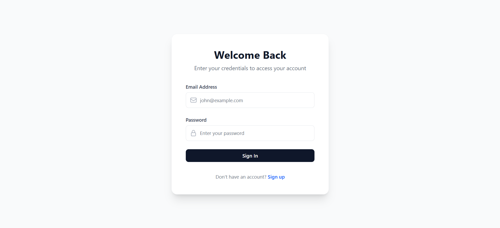
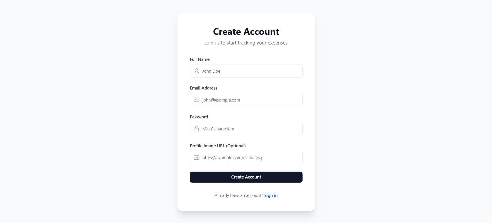
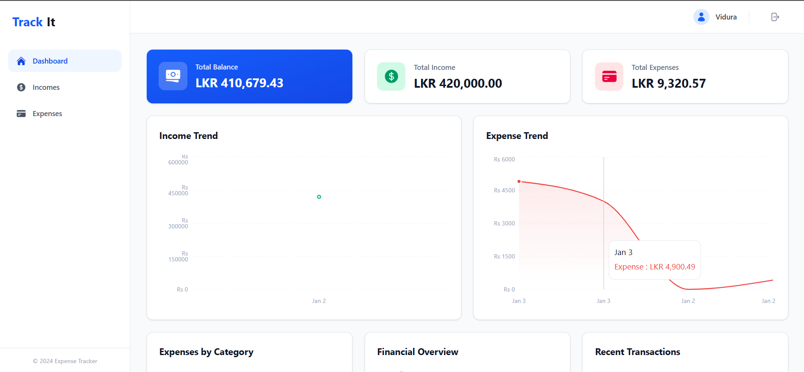
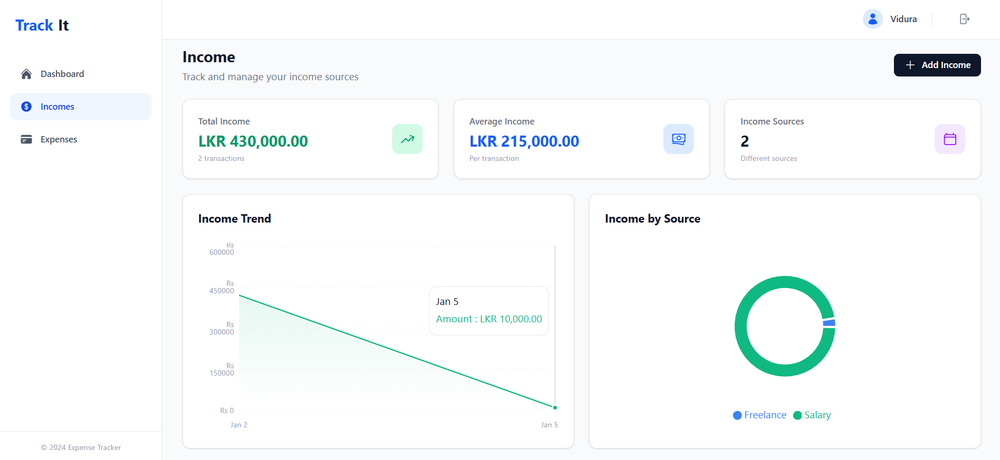
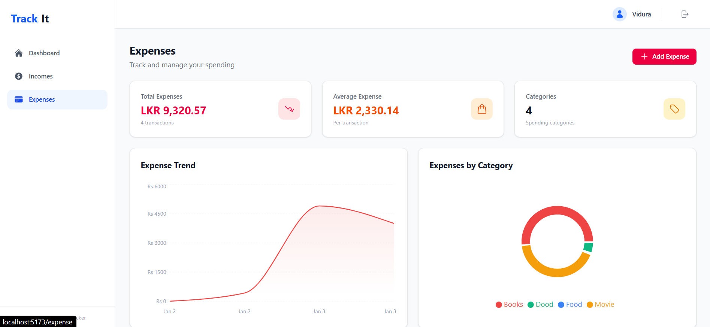

# Expense Tracker - MERN Stack Application

A full-stack expense tracking application built with the MERN stack (MongoDB, Express, React, Node.js). This application helps users efficiently track and manage their personal income and expenses with intuitive visualizations and export capabilities.

---

## Table of Contents

- [Technologies Used](#technologies-used)
- [Features](#features)
- [Project Structure](#project-structure)
- [Prerequisites](#prerequisites)
- [Setup Instructions](#setup-instructions)
- [API Documentation](#api-documentation)
- [Deployed URLs](#deployed-urls)
- [Screenshots](#screenshots)
- [License](#license)

---

## Technologies Used

### Frontend (Client)

| Technology | Version | Purpose |
|------------|---------|---------|
| React | 19.2.0 | Core UI library |
| TypeScript | 5.9.3 | Type safety |
| Vite | 7.2.4 | Build tool and dev server |
| Redux Toolkit | 2.11.2 | State management |
| React Router DOM | 7.11.0 | Client-side routing |
| Tailwind CSS | 4.1.18 | Utility-first CSS framework |
| Recharts | 3.6.0 | Data visualization charts |
| Axios | 1.13.2 | HTTP client for API calls |
| Radix UI | Various | Accessible UI components |
| React Icons | 5.5.0 | Icon library |

### Backend (Server)

| Technology | Version | Purpose |
|------------|---------|---------|
| Node.js | 18+ | Runtime environment |
| Express | 5.2.1 | Web framework |
| MongoDB | - | NoSQL database |
| Mongoose | 9.0.2 | MongoDB ODM |
| TypeScript | 5.7.2 | Type safety |
| JWT | 9.0.3 | Authentication |
| bcrypt | 6.0.0 | Password hashing |
| ExcelJS | 4.4.0 | Excel file export |
| Swagger | 6.2.8 | API documentation |
| Winston | 3.19.0 | Application logging |
| Morgan | 1.10.1 | HTTP request logging |

---

## Features

### Authentication
- User registration with secure password hashing
- JWT-based login authentication
- Protected routes with automatic token management
- User profile management

### Income Management
- Add income entries with source, amount, icon, and date
- View all income records
- Delete income entries
- Export income data to Excel

### Expense Management
- Add expense entries with category, amount, icon, and date
- View all expense records
- Delete expense entries
- Export expense data to Excel

### Dashboard & Analytics
- Financial overview with total balance, income, and expenses
- Last 30 days expense tracking
- Last 60 days income tracking
- Recent transactions view (last 5 combined entries)
- Interactive charts:
  - Category-wise pie chart
  - Expense trend chart
  - Income trend chart
- Stats cards with quick financial summaries

### Additional Features
- Responsive design for all devices
- Modern and intuitive UI
- Swagger API documentation
- Excel export functionality

---

## Project Structure

```
Expense-Tracker-MERN/
├── client/                          # Frontend React application
│   ├── src/
│   │   ├── api/                     # Axios API configuration
│   │   ├── components/
│   │   │   ├── dashboard/           # Dashboard components
│   │   │   │   ├── CategoryPieChart.tsx
│   │   │   │   ├── ExpenseChart.tsx
│   │   │   │   ├── FinancialOverview.tsx
│   │   │   │   ├── IncomeChart.tsx
│   │   │   │   ├── RecentTransactions.tsx
│   │   │   │   └── StatsCards.tsx
│   │   │   ├── layout/              # Layout components
│   │   │   │   ├── AuthLayout.tsx
│   │   │   │   ├── DashboardLayout.tsx
│   │   │   │   ├── Header.tsx
│   │   │   │   └── Sidebar.tsx
│   │   │   └── ui/                  # Reusable UI components
│   │   ├── pages/
│   │   │   ├── auth/                # Login & SignUp pages
│   │   │   └── dashboard/           # Dashboard pages
│   │   ├── store/                   # Redux store & slices
│   │   ├── types/                   # TypeScript interfaces
│   │   ├── App.tsx
│   │   └── main.tsx
│   ├── package.json
│   └── vite.config.ts
│
├── server/                          # Backend Express API
│   ├── src/
│   │   ├── configurations/          # App configurations
│   │   │   ├── db.config.ts         # MongoDB connection
│   │   │   ├── env.config.ts        # Environment variables
│   │   │   ├── logger.config.ts     # Winston logger
│   │   │   ├── morgan.config.ts     # HTTP logging
│   │   │   └── swagger.config.ts    # Swagger setup
│   │   ├── controllers/             # Route controllers
│   │   ├── middlewares/             # Auth middleware
│   │   ├── models/                  # Mongoose models
│   │   ├── routes/                  # API routes
│   │   ├── services/                # Business logic
│   │   ├── types/                   # TypeScript types
│   │   ├── app.ts                   # Express app setup
│   │   └── index.ts                 # Server entry point
│   └── package.json
│
└── README.md
```

---

## Prerequisites

- **Node.js** v18 or higher
- **npm** or **yarn** package manager
- **MongoDB** instance (local or MongoDB Atlas)
- **Git** for version control

---

## Setup Instructions

### 1. Clone the Repository

```bash
git clone https://github.com/your-username/Expense-Tracker-MERN.git
cd Expense-Tracker-MERN
```

### 2. Backend Setup

Navigate to the server directory and install dependencies:

```bash
cd server
npm install
```

Create a `.env` file in the `server` directory with the following variables:

```env
# Server Configuration
NODE_ENV=development
PORT=8080

# Database
MONGO_URI=mongodb://localhost:27017/expense-tracker
# Or for MongoDB Atlas:
# MONGO_URI=mongodb+srv://<username>:<password>@cluster.mongodb.net/expense-tracker

# JWT Configuration
JWT_SECRET=your-super-secret-jwt-key-change-in-production
JWT_EXPIRES_IN=7d

# CORS
CLIENT_URL=http://localhost:5173
```

Start the backend server:

```bash
# Development mode (with hot reload)
npm run dev

# Production mode
npm run start
```

The server will start at `http://localhost:8080`

### 3. Frontend Setup

Navigate to the client directory and install dependencies:

```bash
cd client
npm install
```

Create a `.env` file in the `client` directory (optional - defaults are set):

```env
VITE_SERVER_URL=http://localhost:8080/api
```

Start the frontend development server:

```bash
# Development mode
npm run dev

# Build for production
npm run build

# Preview production build
npm run preview
```

The client will start at `http://localhost:5173`

### 4. Available Scripts

#### Client Scripts

| Command | Description |
|---------|-------------|
| `npm run dev` | Start Vite development server with hot reload |
| `npm run build` | Build for production |
| `npm run preview` | Preview production build locally |
| `npm run lint` | Run ESLint for code quality |

#### Server Scripts

| Command | Description |
|---------|-------------|
| `npm run dev` | Start development server with hot reload |
| `npm run start` | Start production server |

---

## API Documentation

The API documentation is available via Swagger UI at:

```
http://localhost:8080/api-docs
```

### API Endpoints

| Method | Endpoint | Description | Auth Required |
|--------|----------|-------------|---------------|
| **Auth** |
| POST | `/api/auth/register` | Register a new user | No |
| POST | `/api/auth/login` | User login | No |
| GET | `/api/auth/profile` | Get user profile | Yes |
| **Income** |
| POST | `/api/income` | Add new income | Yes |
| GET | `/api/income/all` | Get all incomes | Yes |
| DELETE | `/api/income/:id` | Delete income | Yes |
| GET | `/api/income/downloadExcel` | Export to Excel | Yes |
| **Expense** |
| POST | `/api/expense` | Add new expense | Yes |
| GET | `/api/expense/all` | Get all expenses | Yes |
| DELETE | `/api/expense/:id` | Delete expense | Yes |
| GET | `/api/expense/downloadExcel` | Export to Excel | Yes |
| **Dashboard** |
| GET | `/api/dashboard` | Get dashboard data | Yes |
| **Health** |
| GET | `/health` | Server health check | No |

---

## Deployed URLs

| Application | URL |
|-------------|-----|
| Frontend | [https://expense-tracker-frontend.vercel.app](https://expense-tracker-frontend.vercel.app) |
| Backend API | [https://expense-tracker-api.onrender.com](https://expense-tracker-api.onrender.com) |
| API Documentation | [https://expense-tracker-api.onrender.com/api-docs](https://expense-tracker-api.onrender.com/api-docs) |

> **Note:** Replace the above URLs with your actual deployed application URLs.

---

## Screenshots

### Login Page


### Sign Up Page


### Dashboard


### Income Management


### Expense Management


---

## Environment Variables Reference

### Server Environment Variables

| Variable | Description | Default | Required |
|----------|-------------|---------|----------|
| `NODE_ENV` | Environment mode | `development` | No |
| `PORT` | Server port | `3000` | No |
| `MONGO_URI` | MongoDB connection string | - | **Yes** |
| `JWT_SECRET` | JWT signing secret | - | **Yes** |
| `JWT_EXPIRES_IN` | JWT expiration time | `7d` | No |
| `CLIENT_URL` | Frontend URL for CORS | `http://localhost:5173` | No |

### Client Environment Variables

| Variable | Description | Default |
|----------|-------------|---------|
| `VITE_SERVER_URL` | Backend API URL | `http://localhost:8080/api` |

---

## Contributing

1. Fork the repository
2. Create your feature branch (`git checkout -b feature/amazing-feature`)
3. Commit your changes (`git commit -m 'Add some amazing feature'`)
4. Push to the branch (`git push origin feature/amazing-feature`)
5. Open a Pull Request

---

## License

This project is licensed under the MIT License.

---

## Author

Developed with passion for personal finance management.

---

## Support

If you found this project helpful, please give it a star on GitHub!
